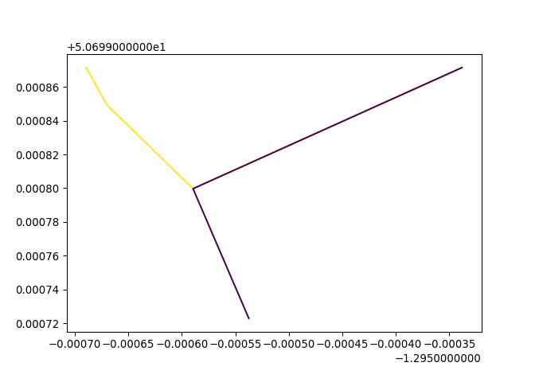
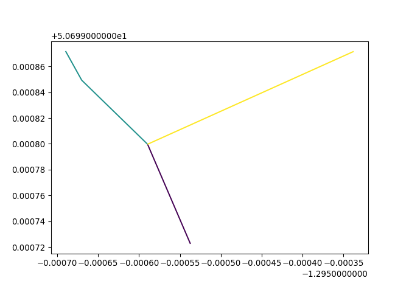
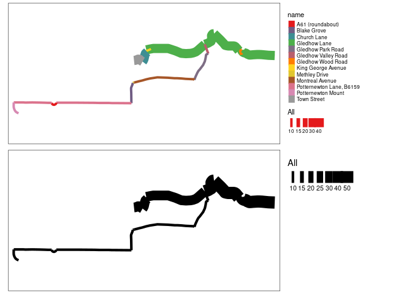

# overline

Overline is a function that takes overlapping linestrings and converts
them into a route network (Morgan and Lovelace 2020) as illustrated in a
minimal reproducible example created with
[ATIP](https://github.com/acteng/atip/).

The input is a dataset in which some segments overlap:

    Reading layer `minimal_2_lines' from data source 
      `/home/robin/github/acteng/overline/test-data/minimal_2_lines.txt' 
      using driver `GeoJSON'
    Simple feature collection with 2 features and 5 fields
    Geometry type: LINESTRING
    Dimension:     XY
    Bounding box:  xmin: -1.29569 ymin: 50.69972 xmax: -1.295337 ymax: 50.69987
    Geodetic CRS:  WGS 84


The output is a dataset in which the overlapping segments have been
combined:


The functionality has been implemented in the [`overline()`
function](https://docs.ropensci.org/stplanr/reference/overline.html) in
the R package `stplanr`. The function works fine for city sized datasets
but for national datasets is slow, buggy and not feature complete, as it
does not retain OSM IDs. This repo provides a place to discuss and
develop example code to solve this problem.

In Python, the input and outputs can be visualised as follows:

``` python
import geopandas as gpd
input = gpd.read_file("input.geojson")
# Plot with colour by value:
input.plot(column="value")
```



``` python
output = gpd.read_file("output.geojson")
output.plot(column="value")
```



# Example with road names

The example below takes routes at the segment level and calculates
average gradient for each segment. Road names are NOT currently
implemented in `overline()` in R.



# Large example

A large example plus benchmark is shown below:

``` r
system.time({
  cycle_routes_london = geojsonsf::geojson_sf("cycle_routes_london.geojson")
  names(cycle_routes_london)
  rnet = overline(cycle_routes_london, attrib = "foot")
})
# sf::write_sf(rnet, "rnet_london.geojson")
# system("gh release upload v0 rnet_london.geojson")
```

The operation took around 2 minutes.

# References

<div id="refs" class="references csl-bib-body hanging-indent">

<div id="ref-morgan2020" class="csl-entry">

Morgan, Malcolm, and Robin Lovelace. 2020. “Travel Flow Aggregation:
Nationally Scalable Methods for Interactive and Online Visualisation of
Transport Behaviour at the Road Network Level.” *Environment and
Planning B: Urban Analytics and City Science* 48 (6): 1684–96.
<https://doi.org/10.1177/2399808320942779>.

</div>

</div>
