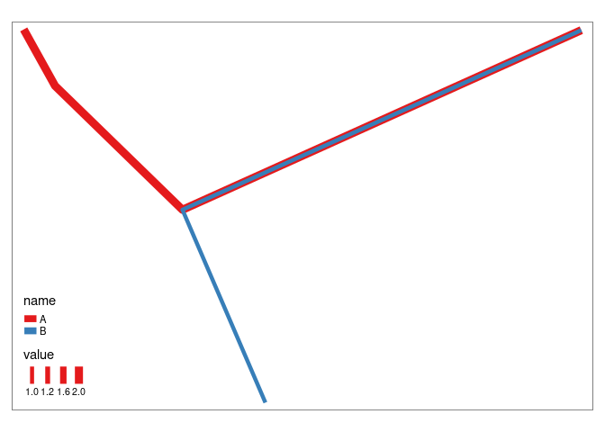
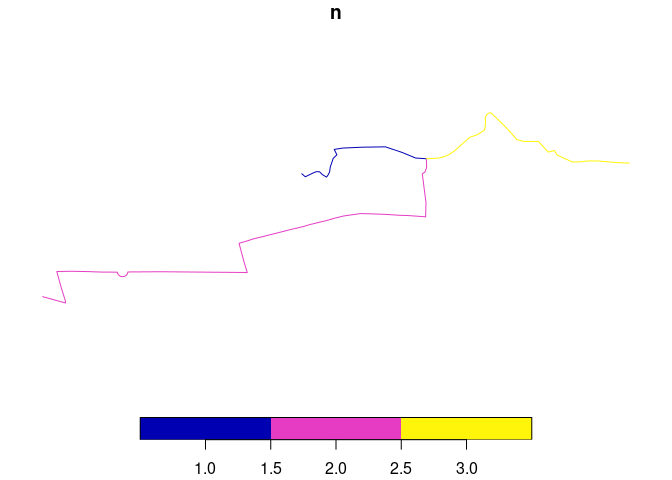
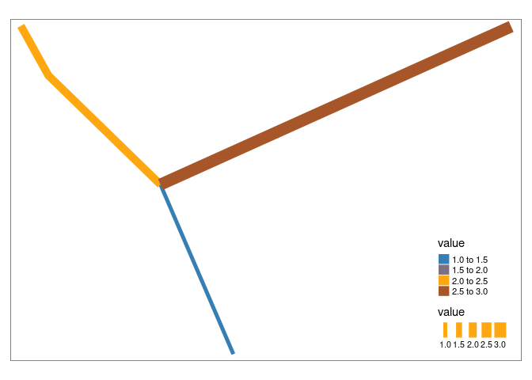
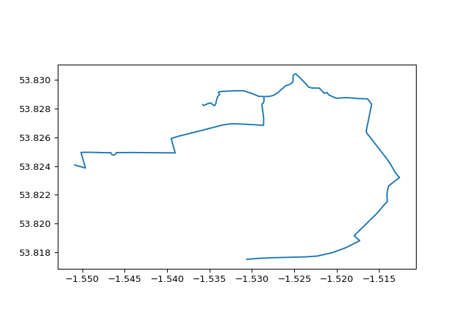

# overline

Overline is a function that takes overlapping linestrings and converts
them into a route network (Morgan and Lovelace 2020) as illustrated in a
minimal reproducible example below.

``` r
library(sf)
library(stplanr)
sl = routes_fast_sf[2:3, 0]
sl$n = 1:2
plot(sl)
```



``` r
rnet = overline(sl, attrib = "n")
plot(rnet)
```



``` r
sf::write_sf(sl, "minimal-example-input.geojson", delete_dsn = TRUE)
sf::write_sf(rnet, "minimal-example-output.geojson", delete_dsn = TRUE)
```

The function has been implemented in the [`overline()`
function](https://docs.ropensci.org/stplanr/reference/overline.html) in
the R package `stplanr`. The function works fine for city sized datasets
but for national datasets is slow, buggy and not feature complete, as it
does not retain OSM IDs. This repo provides a place to discuss and
develop example code to solve this problem.

In Python, the input and outputs can be visualised as follows:

``` python
import geopandas as gpd
input = gpd.read_file("input.geojson")
input.plot()
```



``` python
output = gpd.read_file("output.geojson")
output.plot()
```



# Large example

A large example plus benchmark is shown below:

``` r
# list.files()
cycle_routes_london = pct::get_pct_routes_fast("london")
sf::write_sf(cycle_routes_london, "cycle_routes_london.geojson")
zip("cycle_routes_london.zip", "cycle_routes_london.geojson")
system("gh release upload v0 cycle_routes_london.zip")
```

``` r
cycle_routes_london = geojsonsf::geojson_sf("cycle_routes_london.geojson")
names(cycle_routes_london)
system.time({
  rnet = overline(cycle_routes_london, attrib = "foot")
})
```

# References

<div id="refs" class="references csl-bib-body hanging-indent">

<div id="ref-morgan2020" class="csl-entry">

Morgan, Malcolm, and Robin Lovelace. 2020. “Travel Flow Aggregation:
Nationally Scalable Methods for Interactive and Online Visualisation of
Transport Behaviour at the Road Network Level.” *Environment and
Planning B: Urban Analytics and City Science* 48 (6): 1684–96.
<https://doi.org/10.1177/2399808320942779>.

</div>

</div>
