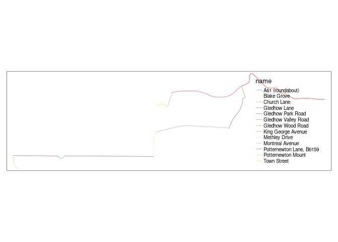
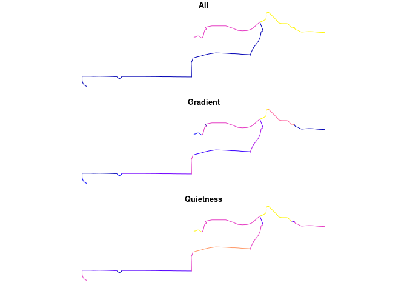

# overline

Overline is a function that takes overlapping linestrings and converts
them into a route network (Morgan and Lovelace 2020) as illustrated in a
minimal reproducible example below.

``` r
library(sf)
library(stplanr)
library(tidyverse)
library(tmap)
sl = routes_fast_sf[2:3, 0]
sl$n = 1:2
plot(sl)
```


``` r
rnet = overline(sl, attrib = "n")
plot(rnet)
```


``` r
sf::write_sf(sl, "minimal-example-input.geojson", delete_dsn = TRUE)
sf::write_sf(rnet, "minimal-example-output.geojson", delete_dsn = TRUE)
```

The function has been implemented in the [`overline()`
function](https://docs.ropensci.org/stplanr/reference/overline.html) in
the R package `stplanr`. The function works fine for city sized datasets
but for national datasets is slow, buggy and not feature complete, as it
does not retain OSM IDs. This repo provides a place to discuss and
develop example code to solve this problem.

In Python, the input and outputs can be visualised as follows:

``` python
import geopandas as gpd
input = gpd.read_file("input.geojson")
input.plot()
```

``` python
output = gpd.read_file("output.geojson")
output.plot()
```


# Example with road names

The example below takes routes at the segment level and calculates
average gradient for each segment. Road names are NOT currently
implemented in `overline()` in R.

``` r
sl_desire_lines = stplanr::flowlines_sf[2:3, ]
qtm(sl_desire_lines) +
  qtm(sl)
```


``` r
route_segments_minimal = stplanr::route(
  l = sl_desire_lines,
  route_fun = cyclestreets::journey
  )
```

    Most common output is sf

``` r
names(route_segments_minimal)
```

     [1] "Area.of.residence"                   
     [2] "Area.of.workplace"                   
     [3] "All"                                 
     [4] "Work.mainly.at.or.from.home"         
     [5] "Underground..metro..light.rail..tram"
     [6] "Train"                               
     [7] "Bus..minibus.or.coach"               
     [8] "Taxi"                                
     [9] "Motorcycle..scooter.or.moped"        
    [10] "Driving.a.car.or.van"                
    [11] "Passenger.in.a.car.or.van"           
    [12] "Bicycle"                             
    [13] "On.foot"                             
    [14] "Other.method.of.travel.to.work"      
    [15] "id"                                  
    [16] "route_number"                        
    [17] "name"                                
    [18] "distances"                           
    [19] "time"                                
    [20] "busynance"                           
    [21] "elevations"                          
    [22] "start_longitude"                     
    [23] "start_latitude"                      
    [24] "finish_longitude"                    
    [25] "finish_latitude"                     
    [26] "crow_fly_distance"                   
    [27] "event"                               
    [28] "whence"                              
    [29] "speed"                               
    [30] "itinerary"                           
    [31] "plan"                                
    [32] "note"                                
    [33] "length"                              
    [34] "quietness"                           
    [35] "west"                                
    [36] "south"                               
    [37] "east"                                
    [38] "north"                               
    [39] "leaving"                             
    [40] "arriving"                            
    [41] "grammesCO2saved"                     
    [42] "calories"                            
    [43] "edition"                             
    [44] "gradient_segment"                    
    [45] "elevation_change"                    
    [46] "provisionName"                       
    [47] "gradient_smooth"                     
    [48] "geometry"                            

``` r
tm_shape(route_segments_minimal) +
  tm_lines("name")
```



``` r
rnet_from_cyclestreets = overline(
  route_segments_minimal,
  attrib = c("All", "gradient_smooth", "quietness"),
  fun = c(sum = sum, mean = mean)
  )
rnet_from_cyclestreets = rnet_from_cyclestreets %>% 
  transmute(All = All_sum, Gradient = gradient_smooth_mean, Quietness = quietness_mean)
plot(rnet_from_cyclestreets)
```



``` r
sf::write_sf(route_segments_minimal, "route_segments_minimal.geojson", delete_dsn = TRUE)
sf::write_sf(rnet_from_cyclestreets, "rnet_from_cyclestreets.geojson", delete_dsn = TRUE)
```

# Large example

A large example plus benchmark is shown below:

``` r
# list.files()
cycle_routes_london = pct::get_pct_routes_fast("london")
sf::write_sf(cycle_routes_london, "cycle_routes_london.geojson")
zip("cycle_routes_london.zip", "cycle_routes_london.geojson")
system("gh release upload v0 cycle_routes_london.zip")
```

``` r
system.time({
  cycle_routes_london = geojsonsf::geojson_sf("cycle_routes_london.geojson")
  names(cycle_routes_london)
  rnet = overline(cycle_routes_london, attrib = "foot")
})
# sf::write_sf(rnet, "rnet_london.geojson")
# system("gh release upload v0 rnet_london.geojson")
```

The operation took around 2 minutes.

# References

<div id="refs" class="references csl-bib-body hanging-indent">

<div id="ref-morgan2020" class="csl-entry">

Morgan, Malcolm, and Robin Lovelace. 2020. “Travel Flow Aggregation:
Nationally Scalable Methods for Interactive and Online Visualisation of
Transport Behaviour at the Road Network Level.” *Environment and
Planning B: Urban Analytics and City Science* 48 (6): 1684–96.
<https://doi.org/10.1177/2399808320942779>.

</div>

</div>
